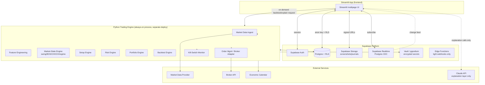

# Personal Trading Operating System — Design Document v0.1

Stack: **Supabase** (Postgres, Auth, RLS, Storage, Realtime, Vault) + **Streamlit** (frontend) + **Python** (quant/risk/backtest engine, worker process).

Status: **Phase 0 approved. Phase 1 (Market Reader) implemented** — see [README.md](README.md) for setup/run instructions. Phases 2+ (market structure strength scoring, risk/sizing, playbooks, backtesting, paper trading, and beyond) are still design-only per the roadmap in §31.

---

## 1. Executive Product Vision

This is not a stock-picking app. It is a **personal trading operating system**: a decision-support and risk-control platform that reads market structure, classifies regime, matches rule-based setups, quantifies risk in real dollars derived from *current* account equity, sizes positions conservatively, and forces "NO TRADE" to be a first-class, frequently-correct output. It journals everything, measures statistical edge honestly (including "insufficient data"), and only unlocks real-money execution after evidence-based graduation criteria are met and a human explicitly approves.

The system optimizes for **decision quality per unit of risk**, not trade frequency or win rate.

Non-negotiables carried into every downstream design choice:
- No hard-coded account size, no hard-coded PDT threshold, no hard-coded regulatory constant.
- Every dollar risk figure derives from current net liquidation value × a user-configurable percentage.
- AI (LLM) layer explains and narrates; it never computes or fabricates prices, fills, PnL, or statistics. All numbers come from deterministic Python + SQL.
- Live execution is locked by default behind a graduation gate.

---

## 2. Product Requirements Document (PRD)

**Users:** initially you (SUPER_ADMIN + trader), architected from day one for multiple users with strict tenant isolation.

**Core jobs to be done:**
1. Tell me, right now, what the market/symbol is actually doing (structure, regime, quality) — not what I want it to be doing.
2. Tell me whether a rule-based, historically-evidenced setup exists — or tell me NO TRADE and why.
3. If a setup exists, tell me exact entry/stop/target, position size derived from my real account risk policy, and my current portfolio heat.
4. Let me paper trade it, journal it automatically, and grade my process — not just my PnL.
5. Only after sufficient validated sample size and manual review, let me flip a specific strategy to live decision-support, and only with manual order confirmation.
6. Give me portfolio-level risk (exposure, correlation, drawdown, kill switches) at all times, not just per-trade risk.

**Out of scope for v1:** autonomous/unattended order submission, options/futures execution (architecture only), fully automated strategy promotion, multi-broker simultaneous smart order routing.

**Success metrics:** NO TRADE is issued and respected on low-quality days; journaled trades have complete required fields >99% of the time; backtest→paper→live statistics are traceable to a specific ruleset version; zero instances of a risk-policy limit being silently exceeded.

---

## 3. Functional Requirements (summary — detailed specs in sections 9–17)

- FR1 Ingest OHLCV + quotes for arbitrary symbol/timeframe, detect data-quality failures, refuse to trade on stale/bad data.
- FR2 Detect swings (major/minor), classify upswing/downswing, HH/HL/LH/LL, uptrend/downtrend/range.
- FR3 Detect BOS and CHOCH with strength classification (weak/moderate/strong) and explicit "reversal not confirmed" language for CHOCH.
- FR4 Classify trend quality (strong → reversal developing), volatility regime, volume/RVOL, opening range, consolidation/compression.
- FR5 Maintain support/resistance as zones with strength/touch/retest metadata.
- FR6 Classify breakout/breakdown attempts through successful/failed/fakeout/retest states with follow-through scoring.
- FR7 Multi-timeframe alignment display, conflicts never hidden.
- FR8 Rule-based, versioned, machine-readable playbook schema; setups disabled until validated.
- FR9 Risk engine: dynamic position sizing from live equity × configured risk %, portfolio heat, exposure limits, correlation limits, kill switches, fail-closed on uncertainty.
- FR10 NO-TRADE engine producing explicit, itemized reasons.
- FR11 Backtest engine with realistic costs, walk-forward/out-of-sample/Monte Carlo, look-ahead-bias prevention.
- FR12 Paper trading mode with full trade capture; live mode locked behind graduation criteria + manual approval.
- FR13 Trade journal + post-trade review separating outcome quality from process quality.
- FR14 Multi-user auth, RBAC, tenant-isolated data via RLS, admin console, audit log.
- FR15 Hedging engine (design in v1; execution later) computing exposure and proposing hedges with explicit objective/cost/removal condition.
- FR16 Event-risk calendar awareness with trade-disabling windows.
- FR17 AI explanation layer strictly bounded to narration over deterministic outputs.

## 4. Non-Functional Requirements

- **Correctness over latency.** This is a decision-support tool for a discretionary/semi-systematic trader, not an HFT system. Sub-second UI refresh is not required; correctness of risk math is non-negotiable and must have deterministic unit tests.
- **Fail closed.** Any uncertainty in data, broker state, or risk calculation → NO TRADE / block, never a best-effort guess.
- **Auditability.** Every trade candidate reproducible from a stored snapshot of data + ruleset version + risk-policy version.
- **Tenant isolation.** Enforced at the database layer (Postgres RLS), never only in application code.
- **Least privilege.** Streamlit frontend never holds broker secrets or the Supabase service-role key; only the backend worker does.
- **Portability of the domain engine.** All market-structure/risk/backtest logic lives in a plain Python package with no Streamlit or Supabase imports, so it is independently unit-testable and reusable if the frontend changes later.

---

## 5. System Architecture



**Why a separate always-on Worker process is required (key decision — see §34):** Streamlit executes inside a request/rerun cycle per user session. It cannot reliably run an always-on kill-switch monitor, continuous market-data ingestion, or scheduled risk evaluation independent of whether a browser tab is open. Supabase Edge Functions run on Deno and cannot host NumPy/pandas/SciPy. Therefore all continuous/background quant work (data ingestion, market-state computation, risk/kill-switch evaluation, scheduled backtests) runs in a **separate long-running Python process** ("the Worker"), deployed independently (e.g., a small VM, Fly.io/Railway container, or a scheduled task runner), which writes results into Supabase tables. Streamlit reads those tables (plus Realtime subscriptions for push-style updates) and only triggers **on-demand, bounded** compute (e.g., "run this backtest now") directly, reusing the same Python engine package.

---

## 6. Component Architecture

Strict separation, enforced by package boundaries (each is an independent, independently-testable Python module — no monolithic prompt, no UI logic inside engines):

| Component | Responsibility | Talks to |
|---|---|---|
| `data_provider/` | Abstract market data, quotes, corp actions, news, calendar | External providers |
| `data_integrity/` | Freshness/staleness/outlier/gap checks | `data_provider` |
| `features/` | ATR, RVOL, volatility regime, swing candidates | `data_provider` |
| `market_state/` | Swing significance, HH/HL/LH/LL, BOS, CHOCH, trend quality, S/R zones, breakout classification, opening range, MTF alignment | `features` |
| `setup_engine/` | Playbook matching against `market_state` output | `market_state`, `playbook` (versioned JSON/YAML rules) |
| `risk_engine/` | Position sizing, portfolio heat, exposure, correlation, kill-switch evaluation | `portfolio_engine`, account state |
| `portfolio_engine/` | Aggregates positions/exposure/drawdown across a user's accounts | Postgres (via repository layer) |
| `trade_qualification/` | Combines setup + risk + context + stats into REJECT/WAIT/CONDITIONAL/QUALIFIED + Trade Card | all of the above |
| `no_trade_engine/` | Emits itemized NO-TRADE reasons whenever qualification fails | `trade_qualification` |
| `backtest_engine/` | Historical replay, cost model, walk-forward, Monte Carlo | `market_state`, `setup_engine`, `data_provider` (historical) |
| `broker_adapter/` | Uniform interface over broker APIs; paper adapter + live adapters | External broker |
| `order_management/` | Order lifecycle, idempotency, reconciliation | `broker_adapter` |
| `journal/` | Trade capture, post-trade review scoring | Postgres |
| `scanner/` | Continuously re-runs `trade_qualification`/`no_trade_engine` across a user's watchlist while the relevant market is open, on each new closed bar; writes append-only `trade_candidates` rows | `market_state`, `setup_engine`, `risk_engine`, `data_integrity`, `trading_calendar` |
| `hedging_engine/` | Exposure/beta/delta aggregation, hedge proposals | `portfolio_engine` |
| `compliance/` | Versioned broker/regulatory rule sets | Postgres (`compliance_rules` table) |
| `explanation/` (AI layer) | Narrates deterministic outputs via Claude API | reads only, never writes trading state |
| `repository/` | All Postgres access (RLS-aware), used by Worker with service-role key and, for read paths, could be swapped to call Supabase from Streamlit directly | Postgres |

Streamlit pages are **thin**: they call `repository/` (read) and, for actions, either write directly to Postgres (simple CRUD like watchlists/settings, protected by RLS) or enqueue a request the Worker picks up (anything requiring the deterministic engines, e.g., "compute trade candidates now", "run backtest").

---

## 7. Trading-Domain Ontology

Canonical vocabulary enforced everywhere (code, DB enums, UI labels) — ambiguous terms like "upward trend" are disallowed by convention/lint:

`SwingPoint {type: HIGH|LOW, major|minor}` → `Upswing` / `Downswing` (movements between points) → structural labels `HH/HL/LH/LL` → `MarketState {UPTREND_CONFIRMED, DOWNTREND_CONFIRMED, RANGE, TRANSITIONAL}` → `StructuralEvent {BOS(strength), CHOCH(direction)}` → `TrendQuality {STRONG, HEALTHY, MODERATE, WEAKENING, FAILURE_RISK, REVERSAL_DEVELOPING}` → `Zone {SUPPORT, RESISTANCE, role_reversal_history}` → `BreakEvent {BREAKOUT_ATTEMPT, WEAK/STRONG, SUCCESSFUL, SUCCESSFUL_RETEST, FAILED, FAKEOUT}` → `VolatilityRegime {VERY_LOW..EXTREME}` → `Decision {REJECT, WAIT, CONDITIONAL, QUALIFIED}`.

Every one of these is an explicit enum type in Postgres (`CREATE TYPE ... AS ENUM`) and a Python `Enum`, never a free-text string, so downstream analytics can segment reliably.

---

## 8. Market-State Finite State Machine

Per (symbol, timeframe), the market state machine transitions on each new confirmed bar:

```
RANGE ──(break above prior SH, i.e. Bullish BOS)──> TRANSITIONAL_BULLISH
TRANSITIONAL_BULLISH ──(pullback holds above prior SL, forms HL)──> UPTREND_CONFIRMED
UPTREND_CONFIRMED ──(break below latest HL = Bearish CHOCH)──> UPTREND_WARNING
UPTREND_WARNING ──(forms LL, then rebound forms LH, then new LL)──> DOWNTREND_CONFIRMED
UPTREND_WARNING ──(price reclaims and forms new HH+HL instead)──> UPTREND_CONFIRMED  (CHOCH invalidated)
UPTREND_CONFIRMED ──(repeated failed HH attempts, deep pullbacks, no new HL break yet)──> UPTREND_WEAKENING (quality sub-state, does not leave UPTREND_CONFIRMED)
(mirror image for RANGE → TRANSITIONAL_BEARISH → DOWNTREND_CONFIRMED, and DOWNTREND_CONFIRMED → DOWNTREND_WARNING → UPTREND_CONFIRMED)
```

Key implementation rule directly from your spec: **the state machine never emits `UPTREND_CONFIRMED` on the BOS bar itself** — only after the subsequent pullback confirms a HL above the prior SL. Until then the state is `TRANSITIONAL_BULLISH`, displayed in the UI, not silently rounded up to "uptrend." Every transition is logged with the exact bar timestamp, the swing points involved, and stored as an immutable `market_state_events` row (never mutated — corrections are new rows) for auditability.

`TrendQuality` is computed as a parallel classifier layered on top of the FSM state (not part of the FSM itself) using the features in §10 of your brief (impulse size, pullback depth/ATR, recovery speed, RVOL, structural-violation count).

---

## 9. BOS / CHOCH Implementation Logic

**BOS** — triggered when close (configurable: close vs. wick) exceeds the prior significant swing high/low by more than a minimum ATR-normalized threshold (configurable, e.g. 0.1×ATR, never hard-coded as a fixed price amount). Strength score is a weighted function of: `close_penetration_ATR`, `body_ratio`, `RVOL_at_break`, `candles_holding_beyond_level`, `retest_result`. Output: `{event: BOS, direction, level, strength: weak|moderate|strong, evidence: {...all raw features...}}`. A single-tick wick breach that closes back inside the prior range is explicitly excluded and logged as a `FAILED_TEST`, not a BOS.

**CHOCH** — computed only relative to an *existing* confirmed trend state (§8). Bullish CHOCH = break above the most recent significant LH while state == `DOWNTREND_CONFIRMED`; Bearish CHOCH mirrors. CHOCH always carries the label `"STRUCTURE WARNING — REVERSAL NOT YET CONFIRMED"` in both the API payload and the UI, and reversal is only confirmed per the FSM transition in §8 (new LL/HH + rebound + opposite structural point).

Both are pure functions of `(swing_history, bar_series, atr_series, volume_series)` — no hidden state, fully unit-testable, fully replayable for backtesting without look-ahead (they only ever reference bars up to and including "now").

---

## 10. Swing-Detection Methodology

Two-stage detector:

1. **Candidate generation:** local extrema over a rolling window (fractal-style, N bars left/right, N configurable per timeframe) — cheap, produces many candidates including noise.
2. **Significance scoring:** each candidate scored on a weighted composite of: ATR-normalized amplitude of the up/downswing into and out of the point, duration, volume behavior at the point, whether it participates in HH/HL/LH/LL structure, proximity to higher-timeframe S/R, and surrounding-candle count. Score thresholds (configurable, versioned) separate `minor` from `major` swings.

The score, its component features, and the algorithm parameter version are **all exposed** via the API/UI (never a black box), and a trader can manually override a classification; overrides are stored in `swing_overrides` with the original algorithmic output preserved, feeding a future recalibration dataset — this is explicitly for future model improvement, not to silently patch the algorithm.

---

## 11. Risk-Engine Specification

Inputs (all fetched live, never cached beyond the current risk-evaluation cycle): `net_liquidation_value`, `cash_balance`, `buying_power`, `open_positions`, `open_risk`, `high_water_mark`, current `risk_policy` row for the user/portfolio.

Computed, per evaluation:
- `max_dollar_risk_per_trade = net_liquidation_value × risk_policy.risk_per_trade_pct`
- `portfolio_heat = Σ open_risk_i / net_liquidation_value`
- `daily_drawdown = (daily_starting_equity − current_equity) / daily_starting_equity`
- `gross_exposure`, `net_exposure`, `beta_adjusted_exposure`, `sector_exposure_pct`, `correlated_risk` (via a rolling correlation matrix over open-position symbols)

Every one of `risk_per_trade_pct`, `maximum_daily_loss_pct`, `maximum_weekly_loss_pct`, `maximum_monthly_drawdown_pct`, `maximum_portfolio_heat_pct`, `maximum_symbol_exposure_pct`, `maximum_sector_exposure_pct`, `maximum_gross_exposure`, `maximum_net_exposure`, `maximum_leverage`, `maximum_correlated_risk`, `maximum_number_of_open_positions`, `maximum_number_of_trades_per_day` lives in a per-user, per-portfolio, **versioned** `risk_policies` row — changing it writes a new version and an audit event, never an in-place mutation of live risk state.

**Fail-closed rule:** if any required input is missing/stale/inconsistent (e.g., broker position count disagrees with local ledger), the risk engine returns `RISK_UNKNOWN`, which the qualification engine (§13) treats as an automatic `REJECT`, never a "best guess."

---

## 12. Position-Sizing Engine

```
risk_per_unit = abs(entry_price − stop_price)
max_trade_loss = net_liquidation_value × risk_policy.risk_per_trade_pct
raw_size = max_trade_loss / risk_per_unit
```

Then clamp `raw_size` down (never up) by, in order: available buying power ÷ entry price; max symbol concentration (`max_symbol_exposure_pct × NLV ÷ entry_price`); max gross/net exposure headroom; liquidity constraint (e.g., ≤ configurable % of average daily volume, to bound market impact); remaining portfolio-heat headroom; correlated-exposure headroom. **Final size = min() of all constraints**, each one individually logged so the UI can show *which* constraint bound the trade (not just the final number). `notional_position_value` (`size × entry_price`) is always displayed distinctly from `max_planned_loss` (`size × risk_per_unit`) — these are never conflated in the UI or the data model.

---

## 13. Trade-Qualification Engine & Portfolio-Risk Model

Qualification evaluates independent dimensions (market structure, location/zones, setup match, volume, volatility regime, market context/relative strength, MTF alignment, risk:reward, liquidity/execution, event risk, statistical edge) and produces a **Trade Card** (exact fields per your §52) plus one of `REJECT / WAIT / CONDITIONAL / QUALIFIED`. A composite score may be shown for *sorting/prioritization only*, explicitly labeled as not a probability (e.g., "Composite Score 74/100 — not a win-probability estimate"). `QUALIFIED` never auto-transitions to an order; it requires a manual "Approve & Send to Paper/Live" action from the user (§56/DecisionStates).

Portfolio-risk model runs the same exposure/heat/correlation/drawdown math at the **user level across all portfolios and accounts**, not just per portfolio, since real risk of ruin is at the person level.

---

## 14. NO-TRADE Engine

Pure function: `evaluate_no_trade(candidate, market_state, risk_state, account_state, calendar_state) -> NoTradeResult | None`. It runs **before** any "what looks good" logic — the qualification pipeline literally checks NO-TRADE conditions first (unclear structure, mid-range location, weak R:R, insufficient sample size for the matched setup, low liquidity/excess spread, weak/extreme volatility, imminent high-impact event, conflicting MTF, daily/weekly loss limit hit, portfolio heat exceeded, correlation conflict, data-quality failure, broker/system uncertainty) and short-circuits to a `NO_TRADE` result with every triggering reason listed — never a single vague reason. This is treated as a successful, common, expected output, not an error path or a UI edge case.

---

## 14a. Live Scanner — Continuous Trade-Candidate Refresh (added per user request)

**Requirement:** a dedicated screen showing every symbol on the user's watchlist with its current REJECT/WAIT/CONDITIONAL/QUALIFIED/NO-TRADE status, refreshing automatically for as long as that symbol's market is open — no manual re-trigger needed. This is distinct from the on-demand single-symbol Trade Card lookup already described in §13/§22.

**Worker-side (`scanner/`):**
- For each user, for each enabled watchlist symbol × enabled timeframe, the scanner re-runs the full `market_state → setup_engine → risk_engine → trade_qualification → no_trade_engine` pipeline **only when that symbol's bar for the configured timeframe has actually closed** — never on a forming/partial bar. This mirrors the no-look-ahead guarantee the backtest engine already relies on (§16): "live" and "backtested" candidate generation are the same deterministic function of "bars up to and including the last closed bar," just fed real-time vs. historical data.
- Every scan pass is preceded by a `data_integrity` check (§29); a symbol with stale/missing/inconsistent data gets an explicit `DATA QUALITY FAILURE` row (itself a form of NO-TRADE, per §14), never a silently-skipped symbol and never a stale `QUALIFIED` sitting on screen without a freshness flag.
- The scanner is strictly gated by market hours via a new `trading_calendar_sessions` table (see below) — it does not run, and does not produce rows that could be mistaken for "live," outside the applicable session. Pre-market/after-hours inclusion is a per-user toggle, not a hardcoded assumption (ties into the existing time-of-day model, §23 of your original brief).
- Results are **appended**, never overwritten: `trade_candidates` is a time-series table (one row per symbol × strategy × scan timestamp), so the journal/audit trail can later show exactly how a candidate's status evolved intraday (e.g., WAIT at 10:05, CONDITIONAL at 10:20, QUALIFIED at 10:35) — consistent with the auditability principle in §27.

**Data model additions:**
- `trading_calendar_sessions(exchange, session_date, market_open_utc, market_close_utc, pre_market_open_utc, after_hours_close_utc, is_holiday, is_half_day, source, last_verified_date)` — sourced from a calendar provider and versioned exactly like `compliance_rules` (§20); never a hardcoded holiday list.
- `scan_settings(user_id, watchlist_id, timeframes[], include_pre_market, include_after_hours, enabled)` — per-user control over what gets continuously scanned and how.
- `latest_trade_candidates` — a Postgres view (`SELECT DISTINCT ON (symbol, strategy_id) ... ORDER BY created_at DESC`) over `trade_candidates`, giving the frontend a cheap "current state" read with zero recomputation.

**Frontend — Live Scanner screen (this is the "Trade Candidates" page from §24, made explicit):**
- A full-watchlist grid, one row per symbol, each showing its decision badge (QUALIFIED/CONDITIONAL/WAIT/NO-TRADE with top reasons) and a "last updated HH:MM:SS" stamp.
- Auto-refreshes via Streamlit's `st.fragment(run_every=...)` (default ~15–30s, user-configurable) reading `latest_trade_candidates` — the UI refresh cadence is independent of and faster than the Worker's scan cadence; it's just polling for whatever the Worker has most recently written.
- A prominent session-state banner driven by `trading_calendar_sessions`: `MARKET OPEN — SCANNING LIVE`, `PRE-MARKET`, `AFTER-HOURS`, or `MARKET CLOSED — SHOWING LAST SESSION'S RESULTS` — the UI must never imply live scanning is happening when it isn't.
- Clicking any row opens the full Trade Card detail view (§13/§52 fields) for that symbol.
- **Scanner-offline detection:** if `latest_trade_candidates.created_at` for a symbol is older than a few multiples of its configured scan interval *while the market banner says open*, the UI shows `SCANNER OFFLINE — DATA MAY BE STALE` rather than quietly continuing to display old rows as current. This is added to the failure-mode table (§29) as its own row.

---

## 15. Hedging-Engine Architecture (design now, execution gated later)

`hedging_engine/` computes `gross_exposure`, `net_exposure`, `beta_adjusted_exposure`, sector exposure, and a rolling correlation matrix across open positions, then — only on explicit user request, never automatically — proposes hedges (index ETFs, sector ETFs, later index/defined-risk options) each carrying: objective, instrument, hedge ratio, notional, estimated cost/drag, expected risk reduction, residual risk, and explicit activation/removal conditions. It never proposes a hedge *because a trade moved against thesis* — that path routes to "consider exiting," a distinct recommendation, not a hedge suggestion. v1 ships analysis-only (no order submission from this engine) until options/futures execution (Phase 10) is unlocked.

---

## 16. Backtesting Framework

Runs entirely against historical bars fetched with an explicit `as_of` cutoff so the market-state/setup engines — being pure functions of "bars up to now" — cannot see future bars (no look-ahead by construction, not by discipline). Cost model applied on every simulated fill: spread, commission, regulatory fees, slippage (configurable model, e.g. volume-participation-based), partial-fill approximation for size vs. average volume. Reports both gross and net-of-cost expectancy side by side, always.

Supports in-sample, out-of-sample (time-split), walk-forward (rolling re-fit windows), Monte Carlo resampling of the trade sequence (for drawdown/ruin distributions), and parameter-sensitivity sweeps. Every backtest run is stored with its exact `ruleset_version`, `data_snapshot_range`, and `parameters` so results are reproducible and comparable across runs — never overwritten in place.

---

## 17. Statistical-Validation Framework

Every expectancy/win-rate/profit-factor figure surfaced anywhere in the UI is accompanied by `sample_size` and, below a configurable minimum sample size, is replaced with `INSUFFICIENT DATA` rather than a misleadingly precise number. Where sample size supports it, a binomial confidence interval is shown alongside the win rate. Results are flagged `SMALL SAMPLE`, `REGIME-SENSITIVE` (performance varies materially by regime segment), or `POSSIBLE OVERFIT` (large in-sample/out-of-sample gap) automatically based on stored segment statistics — not manually asserted.

---

## 18. Broker Abstraction Layer

```python
class BrokerAdapter(Protocol):
    def get_account(self) -> Account: ...
    def get_positions(self) -> list[Position]: ...
    def get_orders(self) -> list[Order]: ...
    def get_buying_power(self) -> Decimal: ...
    def submit_order(self, order: OrderRequest) -> OrderResult: ...
    def cancel_order(self, order_id: str) -> None: ...
    def replace_order(self, order_id: str, changes: OrderChanges) -> OrderResult: ...
    def get_execution(self, order_id: str) -> Execution | None: ...
    def get_margin(self) -> MarginState: ...
    def get_shortability(self, symbol: str) -> ShortabilityInfo: ...
```
`PaperBrokerAdapter` (local simulated fills using the backtest cost model) ships first and is the only adapter wired to "live" UI actions in v1. Real broker adapters (Interactive Brokers, Alpaca) implement the same `Protocol` and are added behind the live-trading graduation gate (§30), never bypassing it.

---

## 19. Market-Data Abstraction Layer

```python
class MarketDataProvider(Protocol):
    def get_ohlcv(self, symbol, timeframe, start, end) -> DataFrame: ...
    def get_quote(self, symbol) -> Quote: ...
    def get_corporate_actions(self, symbol) -> list[CorporateAction]: ...
    def get_options_chain(self, symbol, expiry) -> OptionsChain: ...
    def health(self) -> ProviderHealth: ...
```
Providers are never silently mixed mid-session for the same symbol/timeframe (a `provider_id` is stamped on every stored bar); switching providers requires an explicit config change and is logged.

---

## 20. Compliance / Rule-Versioning Architecture

`compliance_rules(rule_id, rule_type, jurisdiction, broker, value_json, rule_source, effective_date, expiration_date, last_verified_date)`. Nothing about PDT thresholds, margin requirements, or short-sale rules is hard-coded in application logic — the risk/order-management engines look up the currently-effective row. If no currently-effective, recently-verified row exists for a required rule, the UI shows an explicit warning banner and the system does **not** assume a default.

---

## 21. Database / Data Model (Supabase Postgres)

Core entity groups (UUID PKs throughout, `created_at`/`updated_at` on everything, soft-delete via `deleted_at` where destructive-delete would break audit trails):

**Identity & access:** `users` (mirrors `auth.users`, 1:1, holds profile fields), `roles`, `user_roles`, `login_events`, `mfa_methods` (managed mostly by Supabase Auth's own MFA), `admin_audit_events`, `security_events`.

**Portfolio/account:** `portfolios`, `broker_accounts` (secrets referenced via Vault, never stored inline), `trading_accounts`, `positions`, `orders`, `executions`, `trades`, `watchlists`, `watchlist_items`.

**Risk:** `risk_policies` (versioned), `risk_events`, `kill_switch_events`.

**Market/strategy:** `symbols`, `bars` (partitioned by timeframe), `swing_points`, `swing_overrides`, `market_state_events`, `structural_events` (BOS/CHOCH), `sr_zones`, `breakout_events`, `strategies` (playbook JSON + version), `user_strategies` (per-user enable/eligibility), `backtest_runs`, `backtest_trades`, `trade_candidates` (append-only scan output, see §14a), `latest_trade_candidates` (view), `scan_settings`, `trading_calendar_sessions`.

**Journal/compliance:** `journals`, `trade_reviews`, `compliance_rules`, `configuration_changes`.

**Row-Level Security** is the tenant-isolation mechanism (§91 of your brief), not application-level filtering:
```sql
alter table positions enable row level security;
create policy "own positions" on positions
  for select using (
    portfolio_id in (select id from portfolios where user_id = auth.uid())
  );
```
Every user-owned table gets an equivalent policy; `SUPER_ADMIN`/`ADMIN` access goes through a **separate, explicitly-logged path** (a `security definer` Postgres function that records an `admin_access_audit_events` row on every call — see §26), never a blanket "admins bypass RLS" policy, so admin reads are always auditable and intentional, satisfying your "not merely because technically possible" principle.

---

## 22. API Specification

There is no separate REST API layer for CRUD reads — Streamlit uses `supabase-py` with the user's session JWT, and RLS is the enforcement boundary (this is a deliberate architecture simplification enabled by Supabase; see §34 decision table). For **actions that must go through the deterministic engine** (compute trade candidates, run a backtest, evaluate risk, submit a paper/live order), Streamlit calls a small set of Worker-owned functions, exposed either as:
- Postgres rows in a `job_requests` table (Streamlit inserts a row with `status='pending'`; Worker polls/subscribes via Realtime, processes, writes `job_results`, Streamlit reads back) — recommended default, since it needs no extra network surface and reuses Supabase entirely; or
- a thin internal HTTP endpoint on the Worker (FastAPI, not exposed publicly, only reachable from the Streamlit deployment) for cases needing a synchronous request/response (e.g., "give me the Trade Card for this symbol now").

Representative job types: `compute_market_state`, `qualify_trade_candidate`, `run_backtest`, `evaluate_risk`, `submit_paper_order`, `submit_live_order` (gated), `generate_ai_explanation`.

---

## 23. Real-Time Event Architecture

Supabase Realtime streams Postgres changes (`positions`, `orders`, `risk_events`, `kill_switch_events`, `market_state_events`, `trade_candidates`) to subscribed Streamlit sessions. Since Streamlit's execution model is rerun-based, the frontend uses `st.fragment(run_every=...)` (short polling) as the primary mechanism, with a Realtime-backed lightweight client-side listener as an enhancement for near-instant kill-switch/critical-alert banners. This is called out explicitly as a UX constraint versus a true push-WebSocket SPA (see §34).

The **Live Scanner** page (§14a) is the primary consumer of this pattern: it polls `latest_trade_candidates` on a user-configurable interval (default ~15–30s) for as long as `trading_calendar_sessions` says the market is open, and stops polling (showing the "MARKET CLOSED" banner instead) outside session hours — this keeps it from burning Supabase free-tier request quota overnight or on weekends for no reason.

---

## 24. UI Information Architecture (Streamlit)

Multipage app (`st.navigation`), gated by auth + role:

- `Login / Register / MFA / Reset Password`
- `Onboarding` (guided steps per §87)
- `Dashboard` (equity, today's PnL, open risk, portfolio heat, drawdown, warnings)
- `Market Reader` — LEFT: watchlist/scanner · CENTER: interactive chart (Plotly candlesticks + swing/zone/BOS/CHOCH overlays) · RIGHT: Market-State panel (§66 layout) · BOTTOM: positions/orders/journal tabs
- `Live Scanner` — full-watchlist grid, auto-refreshing continuously while the market is open (see §14a for the complete design: scan cadence, market-hours gating, staleness/offline detection); drill-down from any row opens the full Trade Card (REJECT/WAIT/CONDITIONAL/QUALIFIED, NO-TRADE reasons per §52)
- `Playbook` — strategy catalog, enable/disable, sample size, validation status
- `Backtest Lab` — configure run, view results, walk-forward/Monte Carlo views
- `Paper Trading` — order entry against `PaperBrokerAdapter`, live P&L
- `Journal` — trade log, post-trade review, process score
- `Analytics` — segmented performance dashboards
- `Learning Mode` — chart-labeling exercises vs. system interpretation
- `Settings` — profile, risk policy, watchlists, broker connections, MFA, sessions
- `Admin Console` (role-gated, separate nav section) — user management, emergency controls, audit logs, system health

Chart overlays follow §65/§66 exactly: major swings always on, minor swings toggle, S/R zones, ORH/ORL, VWAP, BOS/CHOCH markers, entry/stop/targets when a Trade Card is active.

---

## 25. Wireframes (text form)

**Market Reader page:**
```
┌─ Watchlist/Scanner ─┐ ┌────────── Chart: SPY 5m ──────────┐ ┌── Market State ──┐
│ SPY  ▲ QUALIFIED     │ │  [candles + swings + zones +      │ │ 5m: UPTREND_CONF │
│ QQQ  – WAIT          │ │   BOS/CHOCH markers + ORH/ORL]    │ │ Structure: HH+HL │
│ AAPL ■ NO TRADE       │ │                                    │ │ Quality: Healthy │
│ ...                   │ │                                    │ │ CHOCH: none      │
└───────────────────────┘ └────────────────────────────────────┘ │ RVOL: 1.32       │
┌───────────── Positions / Orders / Journal (tabs) ─────────────┐ │ MTF: 15m Bull    │
│ ...                                                             │ │      1h  Neutral │
└─────────────────────────────────────────────────────────────────┘ │ Event risk: Low  │
                                                                      └──────────────────┘
```
**NO TRADE banner (Trade Card detail):**
```
██  NO TRADE  ██
Reasons:
 - price mid-range, no structural edge
 - R:R only 1.1 (below 1.5 minimum)
 - CPI release in 9 minutes (event-risk lockout)
 - RVOL 0.7 (below liquidity threshold)
```

**Live Scanner page (§14a):**
```
●  MARKET OPEN — SCANNING LIVE          Next refresh in 00:12          Scan interval: 5m (per bar close)
┌────────┬─────────────┬────────────────────────────┬───────────┬───────────┐
│ Symbol │ Decision    │ Top reason                  │ R:R       │ Updated   │
├────────┼─────────────┼────────────────────────────┼───────────┼───────────┤
│ SPY    │ ▲ QUALIFIED │ Bullish BOS + retest hold   │ 2.3 : 1   │ 10:35:02  │
│ QQQ    │ – WAIT      │ HL not yet confirmed         │ —         │ 10:35:02  │
│ AAPL   │ ■ NO TRADE  │ R:R 1.1, RVOL low            │ 1.1 : 1   │ 10:35:02  │
│ TSLA   │ ! STALE     │ SCANNER OFFLINE — data 8m old│ —         │ 10:27:14  │
└────────┴─────────────┴────────────────────────────┴───────────┴───────────┘
(click a row -> full Trade Card)
```

---

## 26. Security Model

- **Auth:** Supabase Auth (email/password via Argon2/bcrypt under the hood, managed by Supabase; TOTP MFA via Supabase Auth's native MFA; optional OAuth providers later). MFA required for `ADMIN`/`SUPER_ADMIN` roles, enforced by an app-level check on role assignment (reject promoting a user to admin without an active MFA factor) plus RLS policies that key off `auth.jwt()` claims for role.
- **Secrets:** broker API keys/tokens stored via **Supabase Vault** (pgsodium-backed encryption at rest); only the Worker's service-role key can decrypt/use them — the Streamlit frontend and the anon/authenticated Postgres roles never have decrypt privileges. Even `SUPER_ADMIN` has no SQL path to plaintext secrets; the admin UI shows only `CONNECTED/DISCONNECTED`, masked account id, and health.
- **Tenant isolation:** RLS on every user-owned table (§21); `service_role` key used only server-side by the Worker, never shipped to the browser.
- **Admin access to portfolios:** routed through a logged `security definer` function (§21/§27), configurable per-deployment to require a reason string, satisfying the "privacy mode" requirement.
- **Transport/session:** Supabase enforces TLS; Streamlit session tied to the Supabase JWT with short-lived access tokens and refresh handled by `supabase-py`; idle session timeout configurable.
- **Live-order safety:** manual confirmation + order preview + final risk preview required before any live submit button is enabled (never auto-submit).
- **Input validation:** all forms validated both client-side (Streamlit widgets) and server-side (Worker/Postgres constraints + check constraints on enums/ranges) — never trust the frontend alone.

---

## 27. Audit Model

`admin_audit_events`, `security_events`, `configuration_changes`, `risk_events`, `kill_switch_events`, and `admin_access_audit_events` are **append-only** (enforced via a Postgres rule/trigger rejecting UPDATE/DELETE from non-superuser roles). Every trade candidate is reproducible: `trade_candidates` stores `data_snapshot_ref`, `strategy_version`, `risk_policy_version`, `feature_values_json`, `decision`, `timestamp` at generation time, so "why did the system recommend this" is answerable months later from stored evidence, not re-derived from current (possibly different) rules.

---

## 28. Testing Strategy

- **Unit tests** on every deterministic engine (`market_state`, `risk_engine`, `position_sizing`, `no_trade_engine`) with hand-constructed bar sequences covering the exact BOS/CHOCH sequencing rules in §8–9 (this is where correctness is easiest to silently get wrong).
- **Property/deterministic tests** on financial math: position size, R, PnL, drawdown, margin, exposure, portfolio heat — fixed-input/fixed-output, no randomness.
- **Historical replay tests**: known historical SPY sessions with expected swing/BOS/CHOCH annotations (hand-labeled) as regression fixtures.
- **Integration tests** against a local Supabase instance (Supabase CLI) with RLS policies actually exercised (test that user A cannot read user B's rows — a real query, not a mock).
- **Broker sandbox tests** against paper adapters, then IBKR/Alpaca paper endpoints.
- **Kill-switch/failure-injection tests**: simulate stale data, broker disconnect, duplicate order, clock skew — assert fail-closed behavior.
- **Concurrency tests** on order submission idempotency.

---

## 29. Failure-Mode Analysis (safe behavior per scenario)

| Failure | Safe behavior |
|---|---|
| Data feed disconnect / stale quote | Freeze trade-candidate generation for affected symbols; show `DATA QUALITY FAILURE`; existing stops/orders untouched |
| Broker disconnect | Block new order submission; reconcile positions on reconnect before allowing new orders |
| Duplicate order detected | Reject second submission; alert; log |
| Partial fill | Update position/risk state from actual fill only; re-evaluate portfolio heat |
| Rejected order | Surface reason; no silent retry with modified parameters |
| Unexpected position (broker vs. local mismatch) | Lock trading for that account; require manual reconciliation |
| Market halt / limit-up-down | Cancel/hold pending orders per broker rules; no new candidates for halted symbol |
| Gap through stop | Log as slippage event; do not auto-widen stop logic retroactively |
| Corporate action | Flag affected historical bars/positions; block backtests spanning unadjusted splits until confirmed adjusted |
| API throttling | Backoff + queue; never drop a risk check silently |
| System restart | Worker reconciles broker state as source of truth before resuming any evaluation |
| Clock desync | Kill switch: `NO NEW TRADES` until NTP-verified |
| Scanner/Worker down during market hours | Live Scanner UI detects stale `latest_trade_candidates.created_at` vs. configured scan interval and shows `SCANNER OFFLINE — DATA MAY BE STALE` per symbol (§14a); never silently displays old rows as current |

---

## 30. Paper-to-Live Graduation Framework

Per-strategy, per-user eligibility states: `NOT_ELIGIBLE → PAPER_ONLY → LIVE_DECISION_SUPPORT → LIVE_MANUAL_EXECUTION` (plus `SUSPENDED`, revocable instantly by `SUPER_ADMIN`). Suggested (configurable, explicitly labeled as example, not universal) graduation criteria: ≥100–150 documented paper trades, adequate per-setup sample size, positive net expectancy (after costs), profit factor > 1, controlled max drawdown, ≥90% rule adherence, no recurring major execution violations, evidence spanning >1 regime, out-of-sample validation. Promotion is **never automatic** — it requires the criteria to be met *and* a manual review/approval action, logged.

---

## 31. Development Roadmap

Phase 0 (this document) → Phase 1 Market Reader (chart, OHLCV, swings, HH/HL/LH/LL, S/R) → Phase 2 Market Structure (BOS/CHOCH, consolidation, breakouts, RVOL/ATR, opening range) → Phase 3 Risk/Trade Planner (entry/stop/target, R, sizing, heat, NO TRADE) → Phase 4 Playbook Engine → Phase 5 Backtesting → Phase 6 Paper Trading (broker sandbox, journal, analytics) → Phase 7 Performance/Risk OS (expectancy, ruin, kill switches, promotion/retirement) → Phase 8 Live Decision Support → Phase 9 Manual Live Execution → Phase 10 Options/Futures/Hedging.

Auth/multi-user/admin console (your §75–98) is threaded through **Phase 1** rather than deferred — Supabase Auth + RLS is cheap to stand up early and everything downstream depends on tenant isolation existing from the start.

---

## 32. Recommended Data Providers — Free Tier First

Explicit constraint from you: **everything starts on free tiers; upgrade only once the system is proving out an edge.** This changes the ranking versus a cost-no-object recommendation.

| Provider | Free tier | Strength | Caveat |
|---|---|---|---|
| **Alpaca Market Data** (recommended default) | Free, unlimited duration, IEX feed | Same account as the free paper broker below — one signup covers data + execution; no card required for paper | IEX-only feed on free tier (single-exchange consolidated-ish data, not full SIP tape) — adequate for structure/swing/BOS/CHOCH work on liquid names like SPY, understates true NBBO-level microstructure |
| Polygon.io free tier | Free, but 5 API calls/min, end-of-day/delayed data only | Clean data model, easy migration path later | Rate limit and delay make it unusable for anything but slow historical backfill — not for the live Market Reader |
| Finnhub / Alpha Vantage free tiers | Free, low rate limits | Useful for news/fundamentals/economic calendar supplement | Not a primary OHLCV source at v1 scale |

**Recommendation:** Alpaca market data for everything through Phase 8. Revisit Polygon/Databento paid tiers only if/when live decision support needs the full SIP tape — treat that as a Phase 8+ upgrade decision, not a v1 requirement.

## 33. Recommended Broker APIs — Free Tier First

| Broker | Free tier | Strength | Caveat |
|---|---|---|---|
| **Alpaca** (recommended starting point) | Paper trading account is fully free, no funding required, no card required | Excellent REST/WebSocket API, native paper environment, commission-free equities when you do go live | Options/futures support more limited |
| Interactive Brokers | Paper account is free, but IBKR's API (TWS/Gateway) is heavier to integrate and effectively assumes an eventual funded account | Best asset-class coverage (options, futures, international) | Not worth the integration cost until Phase 10 (options/futures) is actually being built |

**Recommendation:** Alpaca paper account for all of Phases 1–9 — it costs nothing at any point in that range, including once you flip to `LIVE_MANUAL_EXECUTION` (Alpaca doesn't require a minimum-balance-gated paid tier to trade live equities). Add IBKR only when Phase 10 (options/futures) is actually reached, since that's the point Alpaca's coverage runs out.

## 32a. Free-Tier Infrastructure Plan (Supabase, hosting, LLM)

| Layer | Free option | Limits to know | Upgrade trigger |
|---|---|---|---|
| **Supabase** | Free project tier | ~500MB DB, 1GB file storage, 50K MAU on Auth — all far beyond a single/small multi-user personal system; **free projects pause after 7 days with no API activity** (a quick dashboard visit or any Worker call un-pauses it) | DB size approaching the cap, or needing the project to survive >7 days fully idle without a keepalive |
| **Streamlit frontend hosting** | Streamlit Community Cloud (free, deploys straight from a GitHub repo) | Public apps are unlimited; private apps are capped on the free tier; app sleeps after inactivity and cold-starts on next visit | Wanting the dashboard always-warm, or more than the free private-app allowance |
| **Worker process hosting** | **Run it locally** on your own machine during Phases 1–7 (design, backtesting, paper trading) — genuinely $0, and appropriate since this is a personal system and you'll be the one watching it during market hours anyway | Only runs while your machine is on and the process is running; no uptime guarantee, which is fine for paper trading but not for a real kill-switch monitor babysitting live risk | Once you're near Phase 8 (live decision support), move the Worker to a permanently-free small VM — **Oracle Cloud "Always Free" Ampere VM** is the standout option here (genuinely free indefinitely, not a trial), so uptime stops depending on your laptop |
| **LLM explanation layer (Claude API)** | No free tier — this is the one component that isn't free | Usage is narration-only, on-demand (§58), not called on every bar/tick, so cost stays low; you're likely already paying for a Claude subscription/API access separately | Not really an "upgrade" — just keep explanation calls on-demand rather than continuous to keep this near-zero |

Net effect: the entire stack through Phase 7 (design → paper trading, multi-user auth, journaling, backtesting) runs at **$0 infrastructure cost** — Supabase free tier + Streamlit Community Cloud (or fully local) + a locally-run Worker + Alpaca paper. The first cost you'll actually hit is Claude API calls for the explanation layer, and even that's optional/deferrable.

---

## 34. Key Technical/Product Decisions Requiring Your Approval

| # | Decision | Option | Advantages | Disadvantages | Recommendation |
|---|---|---|---|---|---|
| 1 | Background/real-time processing model | **(A)** Separate always-on Python Worker process alongside Streamlit (chosen above) | Enables true continuous kill-switch monitoring, data ingestion, scheduled backtests independent of browser sessions; reuses one engine package | Second deployable to run/monitor; more infra than "just Streamlit" | **(A)** — required for the risk/kill-switch guarantees this spec demands |
| | | (B) Everything inside Streamlit (`st.fragment(run_every=...)` polling only, no separate process) | Simplest possible deploy, one process | No true background monitoring when no tab is open; kill-switches only evaluate when a user is actively viewing the app — unacceptable for a risk system | Not recommended |
| 2 | Frontend↔engine integration for compute-heavy actions | **(A)** `job_requests`/`job_results` tables + Realtime (chosen above) | No extra network surface, fully within Supabase, simple to secure via RLS | Slight latency (poll/subscribe round-trip) vs. direct call | **(A)** for most actions |
| | | (B) Internal FastAPI endpoint on the Worker for synchronous calls | Lower latency for on-demand "give me this now" requests | Extra service surface to secure (must not be publicly reachable) | Use **(B)** only for latency-sensitive synchronous reads (e.g., live Trade Card), keep it internal-network-only |
| 3 | Charting library in Streamlit | **(A)** Plotly candlesticks + shapes/annotations for overlays | Mature, flexible, easy custom overlays (zones/BOS/CHOCH markers), good Streamlit support | Not a native TradingView feel | **(A)** — best fit for custom structural overlays |
| | | (B) `streamlit-lightweight-charts` (TradingView-style component) | More professional trading-terminal look/feel | Community component, less flexible for custom annotation types (zones, structural events) | Consider later as a visual upgrade once overlay needs stabilize |
| 4 | Secrets for broker credentials | **(A)** Supabase Vault (pgsodium), decrypt only via Worker service-role | Built into Supabase, least-privilege by construction, admins never see plaintext | Ties you to Supabase's Vault implementation | **(A)** |
| | | (B) External secrets manager (AWS/GCP KMS) | Best-practice at large scale, provider-agnostic | Extra infra dependency, overkill for a personal platform at this stage | Not recommended for v1 |
| 5 | Where the Worker runs | **(A)** Locally on your machine for Phases 1–7, then migrate to Oracle Cloud's permanently-free Ampere VM once approaching Phase 8 (chosen — see §32a) | $0 at every stage, no paid tier ever strictly required; local phase matches "you're watching it anyway" during paper trading | Local phase has no uptime guarantee (fine pre-live); free-tier cloud VMs can have provisioning friction to set up | **(A)** |
| | | (B) Paid always-on VM/container from day one (Fly.io/Railway/Render) | Simplest mental model, no later migration | Recurring cost from day one, contradicts the free-tier-first constraint | Not recommended until Phase 8 makes uptime load-bearing, and even then the free Oracle VM covers it |
| | | (C) Scheduled/cron-triggered short-lived function only | Cheapest possible | Cannot do true continuous monitoring; gaps between runs are a risk-control gap | Not recommended as the *only* mechanism; acceptable only for non-critical periodic jobs (e.g., nightly backtests) layered on top of (A) |
| 6 | Options/futures/live-execution timing | **(A)** Fully gated behind Phase 8–10 and graduation criteria (chosen, per your explicit instruction) | Matches your stated non-negotiable philosophy; forces evidence before risk | Slower path to "real" trading | **(A)** — non-negotiable per your own spec, not really optional |

**Please confirm:** (1) approval of the overall architecture and the Worker-process decision in particular, since it's the one genuine deviation from "just Streamlit + Supabase, nothing else to run" — note it runs locally at $0 through Phase 7 per §32a, so it doesn't conflict with the free-tier-first constraint; (2) Alpaca as the initial data+broker choice (free paper account, no card required); (3) whether you want the admin console as a role-gated section of the same Streamlit app or a fully separate deployment; and (4) approval to begin Phase 1 (Market Reader: OHLCV ingestion, swing detection, HH/HL/LH/LL, basic S/R) once the above is confirmed.

**I am stopping here per your instructions — no Phase 1 code will be written until you approve this design.**
